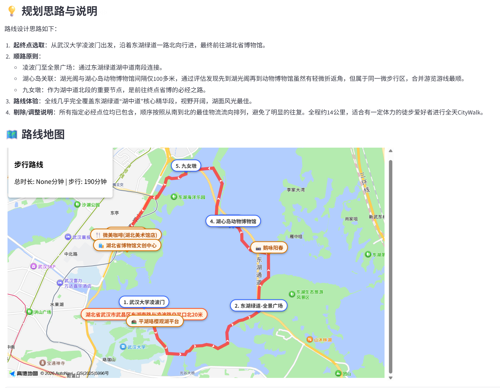

# 🚶‍♂️ CityWalk Agent

> **把规划的烦恼交给 AI，把所有的精力留给风景。**

[](https://www.python.org/downloads/)
[](https://python.langchain.com/docs/langgraph)
[](https://qdrant.tech/)

## 🌟 为什么做这个项目？

你是否曾因为做攻略太麻烦、查路线太繁琐，而放弃了周末出门走走的念头？

**CityWalk Agent** 是一个基于LLM Agent与 RAG 技术的城市漫游智能体。它的诞生只有一个目的：**消除出门前的“规划内耗”**。

你只需要告诉它你的起点、时间和随性的想法（比如：*“我住在武昌的昙华林，今天大概只有3个小时散步。我想徒步去粮道街吃个过早，然后再走到黄鹤楼的外面拍张照，最后走回昙华林。全程步行，路线尽量安排有武汉老街巷感觉的。”*），它就能为你生成一条充满惊喜、路线合理、且包含真实社区经验的专属 CityWalk 路线。

**别让复杂的攻略困住你的脚步，即刻出发，去感受城市的呼吸。**

## ✨ 核心亮点

- 🗣️ **随性输入，懂你所想**：不需要精确的目的地，支持极度口语化、情绪化的自然语言输入（如“想去有树荫的老街喝咖啡”）。
- 📚 **融合真实社区经验 (RAG)**：接入小红书等真实游记数据，拒绝千篇一律的游客打卡，带你探索城市的隐秘角落与地道体验。
- 📍 **智能地理计算**：结合地图 API 工具，Agent 会自主校验 POI、计算步行距离，确保路线的连贯性与真实可行性，绝不让你走冤枉路。
- 🧠 **multi Agent 架构**：基于 LangGraph 构建的multi Agent 工作流，具备自我反思与路线纠错能力。

## 🗺️ 示例

**User Prompt:** "我现在在武汉市的武汉大学的凌波门，想要去东湖走路，给我推荐一条走路不错的路线，就是在绿道上随便走走，相当于经过东湖绿道全景广场、湖心岛动物博物馆这个路，然后到湖北省博物馆结束吧"


### 交互式生成过程


### 最终路线渲染


## 🛠️ 技术架构

<div align="center">
  
</div>

本项目采用 Agentic Workflow 设计：
- **核心框架**: [LangGraph](https://github.com/langchain-ai/langgraph) 
- **知识库 (RAG)**: Qdrant 向量数据库 + 混合检索 
- **外部工具 (Tools)**: 高德地图 API (路线规划、POI 检索、步行距离计算)
- **大模型**: 支持 OpenAI、DeepSeek、Gemini、MiniMax 等主流 LLM

## 🚀 快速开始

### 1. 环境准备
```bash
# 克隆项目
git clone https://github.com/yourusername/CityWalkAgent.git
cd CityWalkAgent

# 创建虚拟环境并安装依赖
conda create -n cwAgent python=3.10
conda activate cwAgent
pip install -r requirements.txt
```

### 2. 配置环境变量
```bash
# 复制环境变量模板
cp .env.example .env

# 编辑 .env 文件，填入你的 API Keys
# 至少需要配置以下必填项：
# - AMAP_KEY: 高德地图 API Key (申请地址: https://lbs.amap.com/)
# - OPENAI_API_KEY: LLM API Key (支持 OpenAI、DeepSeek、MiniMax 等)
```

### 3. 运行 Agent
```bash
python citywalk_plan_execute/run_with_map.py
```
或者直接启动前端
```bash
python -m streamlit run app.py
```


## 📚 关于 RAG 知识库数据

出于版权和隐私保护，本项目开源代码中**不包含**真实的小红书爬取数据。仓库默认附带的是一套可直接跑通流程的武汉场景脱敏示例：

- `rag/data/example_cards_llm.jsonl`：5 条强脱敏后的示例帖子
- `rag/data/example_chunks.jsonl`：对应的 chunk 数据
- `rag/data/qdrant_local_example/`：预构建好的本地 Qdrant toy index

默认配置已经指向这套 example 资产，因此克隆仓库后无需自行准备真实帖子，也可以直接体验完整的 CityWalk Agent 流程。

需要注意的是：**检索时的 query embedding 仍然通过外部 embedding API 生成**，所以运行前依然需要配置可用的 embedding API 凭证。

如果你希望获得更好的路线规划体验，建议你：
1. 自行收集目标城市的游记数据。
2. 按照 `rag/schema.py` 中的数据结构进行清洗。
3. 运行 `python rag/build_index.py` 将数据向量化并存入新的 Qdrant collection。
4. 在 `citywalk_plan_execute/configuration.py` 或运行时配置中覆盖 `rag_collection`、`rag_qdrant_path`、`rag_notes_jsonl` 到你的私有数据资产。

---
**免责声明**：本项目仅供技术交流与学习使用，AI 生成的路线可能存在不合理或与实际情况不符的地方，出门游玩请以实际路况和安全为准，请勿过分认真。
